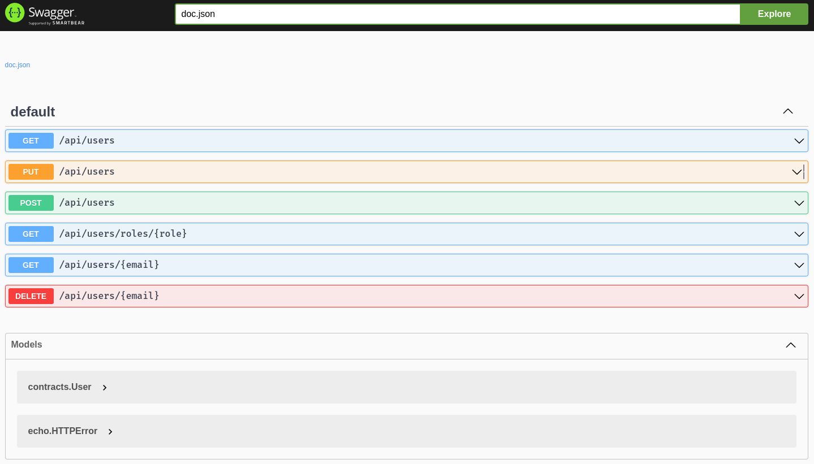

# Описание
Цели данного задания:
* Практика использования библиотек для работы с http: `labstack/echo` и `go-resty/resty`
* Проектирование и использование NoSQL key/value хранилища с использованием `boltdb/bolt`
* Создание CLI приложения с использованием `spf13/cobra`
* Использование Unix Domain Socket как альтернативы TCP в качестве транспорта для http коммуникации в рамках одной машины

Приложение будет состоять из 2ух частей:
* `server` - http сервер, который будет обрабатывать приходящие запросы и хранить данные в `boltdb/bolt`
* `cli` - cli приложение, написанное с использованием `spf13/cobra`, которое будет отправлять запросы на сервер используя `go-resty/resty`

Коммуникация между клиентом и сервером будет осуществляться с помощью Unix Domain Socket

## Проектирование хранения данных
Для хранения информации мы будем использовать встраиваемую NoSQL базу данных `boltdb/bolt`.
Наше приложение должно хранить информацию о пользователях и их ролях и предоставлять следующие операции:
* Получение списка пользователей (всех, по роли или по email)
* Добавление пользователя
* Модификацию пользователя
* Удаление пользователя

Для хранения данных мы будем использовать 2 bucket'а:
* `users` - хранит информацию о пользователях. Ключом будет являться email пользователя, а значением - структура `User`
* `roles` - хранит информацию о ролях во вложенных бакетах для каждой роли. Ключом будет название роли, а значением - бакет с email'ами пользователей, которые имеют данную роль

Для того чтобы менять роли пользователям следует использовать тип `Set` и его методы `Difference` и `Equals`

## Тест
Тестирование приложения будет осуществляться с помощью `cli` приложения.
Это все на вас. Придумайте какие-нибудь тесты, меняйте юзеров и их роли, проверяйте доступность пользователей, через различные get запросы

# Продложение к заданию #1
Для того чтобы познакомиться с генерацией Swagger спецификации и использованием Swagger UI, мы добавим в приложение такую возможность.

## Что нужно сделать
1) Добавить 2 флага: -addr и -listener-type
    * -addr - адрес, который будет использоваться при создании листенера
    * -listener-type - тип листенера, который будет использоваться при создании листенера (tcp или unix)
    * Без использования флагов приложение не должно изменить свое поведение
2) Написать аннотации к методам, которые будут использоваться для генерации Swagger спецификации
    * Описывайте все методы в `handler.go`. Описание состоит из шапки и из коментариев которые относятся к каждому хендлеру в отдельности
    * Ссылка на формат: https://github.com/swaggo/swag#declarative-comments-format
3) Установить swag: `go install github.com/swaggo/swag/cmd/swag@latest`
4) В директории `server` сгенерировать документацию: `swag init --parseDependency`
5) Заимпортировать в main сегенерированную документацию `import _ "github.com/cloudmachinery/apps/http-userroles/server/docs"`
6) Добавить эндпоинт для получения документации: `e.GET("/swagger/*", echoSwagger.WrapHandler)` (для этого нужно установить `echoSwagger` пакет: `go get -u github.com/swaggo/echo-swagger`)
7) Запустить приложение на tcp листенере, открыть его в браузере по адресу `http://localhost:8080/swagger/index.html` (порт может отличаться) и проверить что документация отображается корректно

## Примеры аннотаций:
* Router - путь до эндпоинта и его метод: `// @Router /api/users/{email} [delete]`
* Param - параметр эндпоинта:
    * Если параметр пути: `// @Param email path string true "User email"`
    * Если параметр body: `// @Param user body contracts.User true "User"`
* Success - какой ответ ждать при успешном выполнении `// @Success 200 {array} contracts.User`
* Failure - какой ответ ждать при ошибке `// @Failure 400 {object} echo.HTTPError`
    * Укажите по аннотации для каждого кода ошибки

## Итоговая страница Swagger документации


## Тест
1) Запустите сервер
2) Откройте в браузере страницу документации
3) Проверьте что все эндпоинты описаны корректно
4) Вызовите каждый эндпоинт и проверьте что ответы соответствуют описанию

# Продложение к заданию #2
Для того чтобы познакомиться с библиотекой `jacks/pgx`, моделированием баз данных и получить практический опыт работы с интерфейсами мы попытаемся сделать поддержку PostgreSQL хранилища в нашем приложении.

## 1. Вводим `context.Context`
1) Добавьте неиспользующийся параметр `_ context.Context` во все методы Store, включая `Close`. По соглашениям контекст является первым параметром в методах, которые его используют
2) В хендлерах передавайте контекст реквеста через `c.Request().Context()` в методы Store
3) Проверьте что код компилируется и приложение работает как и раньше

## 2. Выделяем интерфейс и расширяем структуру проекта
1) Создадим в сервере новый пакет `store` добавив папку `store` в папку `server`
2) В этой папке создадим следующие файлы:
    * `store.go` - содержит интерфейс `Store` в котором будет метод `Close(context.Context) error` и еще 6 функций связанных для получения данных. Также этот файл должен содержать все ошибки связанные с хранилищами (у нас их 2)
    * `set.go` - сюда мы просто перетащим наш сет
    * `boltdb.go` - сюда мы перетащим нашу реализацию хранилища на основе `BoltDB`. Назовем ее `BoltDBStore`. Для того чтобы убедиться в реализации интерфейса добавим строку `var _ Store = (*BoltDBStore)(nil)` перед объявлением структуры
    * `roles.go` - сюда мы перетащим нашу функцию `adjustRoles`, которую мы также хотим использовать в `PostgresStore`. Ее придется немного изменить чтобы она не зависила от `BoltDB`
    * `postgres.go` - здесь мы реализуем нашу новую реализацию хранилища на основе `PostgreSQL`. Назовем ее `PostgresStore`. Для того чтобы убедиться в реализации интерфейса добавим строку `var _ Store = (*PostgresStore)(nil)` перед объявлением структуры

## 3. Переходим к созданию `PostgresStore`
1) Создайте структуру `PostgresStore` в файле `postgres.go` с единственным полем `db *pgx.Conn` - это наш доступ к базе данных
2) Создайте конструктор `NewPostgresStore` который будет принимать `context.Context` и строку подключения к базе данных и возвращать `*PostgresStore` и `error`
3) В конструкторе создайте подключение к базе данных и сохраните его в поле `db` структуры, а потом выполните инициализацию схемы баз данных (2 таблицы и 2 индекса)
4) Из конструктора мы должны возвращать хранилище с полностью проинициализированной базой

## 4. Добавляем флаг `-con-string`
1) Добавьте в `main.go` флаг `-con-string` с описанием `Connection string to store`
2) Если значение в нем начинается на `boltdb://`, то берите остаток строки как путь к файлу и создавайте хранилище на основе `BoltDB`
3) Если значение в нем начинается на `postgres://`, то передавайте всю строку как строку подключения в `NewPostgresStore` и создавайте хранилище на основе `PostgreSQL`. Также передайте в функцию контекст, который истечет через 5 секунд для того, чтобы ограничить время на подключение и иницаилазацию базы данных
4) Если значение в нем начинается не на `boltdb://` и не на `postgres://`, то выведите ошибку `unknown connection string. Only boltdb://* and postgres://* are supported`
5) Проведите все эти манипуляции в отдельной функции `func getStore(connString string) (store.Store, error)` в файле `main.go`
6) Создайте `Makefile` с таргетами `stop-db`, `run-db` аналогичными тем, что мы делали в задании `sql-querier`. Также добавье таргет `run-server`
```
SERVER_ADDR ?= ":8080"
DB_HOST ?= localhost
run-server:
	cd server && go run . -listener-type tcp -addr $(SERVER_ADDR) -conn-string "postgres://$(DB_USER):$(DB_PASSWORD)@$(DB_HOST):$(DB_PORT)/$(DB_NAME)?sslmode=disable"
```

## 5. GetUsers
1) Джоиним таблицы и возвращаем юзеров с ролями
2) Используйте контекст при передаче в функцию `Query`
3) Для того чтобы переиспользовать код сканирования юзеров в модели создадим функцию `func scanUsers(rows pgx.Rows) ([]*contracts.User, error)`
4) Используйте мапу для того, чтобы собирать ряды относящиеся к одному юзеру в один объект `contracts.User`
5) Помните, что несмотря на то, что поле `role` является `NOT NULL` оно может быть `NULL` в результате `LEFT JOIN`. Это лишь значит, что у нас есть юзер без ролей. Для того чтобы сканировать такие данные используйте тип `*string` для роли и проводите проверку на `nil` после сканирования
6) После сбора все юзеров в мап возвращаем их в виде среза дополнительно отсортировав по `email`

## 6. GetUser
1) Джоиним таблицы и возвращаем юзера с ролями (по аналогии с `GetUsers`). Используем фильтрацию по email.
2) Учтите, что вам нужно использовать `Query`, не `QueryRow`, так как даже один юзер может быть представлен несолькими строками после джоина
3) Если вы не получили ни одной строки, верните `ErrUserNotFound`
4) Выделите функцию сканированя рядов в одного юзера `func scanUser(rows pgx.Rows) (*contracts.User, error)`

## 7. CreateUser
1) Функция CreateUser должна менять данные в двух таблицах сразу `users` и `roles`. Для этого используйте транзакцию. Лучше всего создать обертку для работы транзакций `inTransaction`
2) Попытка вставки пары `email`, `full_name` может завершиться ошибкой в случае если такой `email` уже существует. Используйте пакет `pgerrcode` для того чтобы отловить нарушение уникальности и вернуть `ErrUserAlreadyExists`
```
if err != nil {
    if pgErr, ok := err.(*pgconn.PgError); ok && pgErr.Code == pgerrcode.UniqueViolation {
        return ErrUserAlreadyExists
    }

    return fmt.Errorf("insert user: %w", err)
}
```
3) После вставки юзера в таблицу `users` вставьте роли используя отрефакторенную версию `adjustRoles`

## 8. UpdateUser
1) Функция `UpdateUser` опять использует транзакции
2) Для того, чтобы переиспользовать логику `GetUser` в `UpdateUser` вам нужно будет создать вспомогательный интерфейс, который объединит `pgx.Conn` и `pgx.Tx`
```
type queryable interface {
	Exec(ctx context.Context, sql string, arguments ...interface{}) (pgconn.CommandTag, error)
	Query(ctx context.Context, sql string, optionsAndArgs ...interface{}) (pgx.Rows, error)
	QueryRow(ctx context.Context, sql string, optionsAndArgs ...interface{}) pgx.Row
}
```
3) Теперь создайте функцию `func getUser(ctx context.Context, q queryable, email string) (*contracts.User, error)` и перенесите в ее код из `GetUser` и вызовите ее из `GetUser`. Теперь `getUser` универсальная и может работать как в транзакции, так и вне ее
4) Теперь используйте `getUser` в `UpdateUser`. Учитите, что если getUser вернет `ErrUserNotFound`, то вы должны не изменять эту ошибку возвращая ее из `UpdateUser`
5) После того как вы получили все данные о юзере мы можем приступить к его обновлению. Используйте `UPDATE users SET ...` запрос и `adjustRoles` в рамках одной транзкации

## 9. DeleteUser
1) Выполните `DELETE FROM ...` запрос и проверьте кол-во затронутых рядов. Если их 0 - верните ошибку `ErrUserNotFound`
2) В этой функции можно не менять вручную роли, так как они удалятся благодаря `ON DELETE CASCADE` внешнего ключа

# Тест
1) Запустите `make run-db`
2) Запустите `make run-server`
3) Выполните создание юзеров с 0, 1 и более ролями через SwaggerUI. Выполняйте создание юзеров с уже существующими email. Проверяйте корректность ошибок и статус кодов
4) Изменяйте существующих и несуществующих юзеров. Изменяйте им роли
5) Проверяйте, что все юзеры обновляются и достаются через `GetUsers`, `GetUsersByRole` и `GetUser`
6) Удаляйте юзеров и проверяйте, что они удаляются из базы. Пытайтесь удалить несуществующих юзеров

# Продолжение к заданию #3
Для того чтобы поработать с HTTPS мы создадим пару `server.key` и `server.cert` и будем использовать их в качестве приватного ключа и сервификата для TLS

## 1. Создайте пару ключей используя `openssl`:
`openssl req -x509 -newkey rsa:2048 -nodes -keyout server.key -out server.crt -days 365`

## 2. Выделите работу с флагами в структуру `config` и функцию `parseConfig`
1) Перенесите данные получеаемые из флагов в структуру `config`
2) Добавьте дополнительные поля `KeyPath`, `CertPath`, `TLSAddr` в структуру `config`
3) Добавьте соответствующие флаги. При наличии установленного `TLSAddr` оба пути к приватному ключу и сертификату должны быть указаны
4) Переработайте функцию `main` так, чтобы при наличии `TLSAddr` сервер запускался с TLS (`echo.Echo.StartTLS`), а при его отсутствии как и раньше с помощью сконфигурированного листенера и функции `echo.Echo.Start`. Лучше это сделать в конце main, после регистрации путей.

## Тест
1) Запустите скрипт `make run-https-server` и убедитесь что вы можете обращаться к серверу через HTTPS (`https://localhost:8443/swagger/index.html`). Игнорируйте сообщение браузера о том, что сертификат не доверенный
```Makefile
SERVER_TLS_ADDR ?= ":8443"
run-https-server:
	cd server && go run . -tls-addr $(SERVER_TLS_ADDR) -cert "server.crt" -key "server.key" -conn-string "postgres://$(DB_USER):$(DB_PASSWORD)@$(DB_HOST):$(DB_PORT)/$(DB_NAME)?sslmode=disable"
```

# Продолжение к заданию #4
Для того чтобы попрактиковаться с контейнеризацией мы создадим Dockerfile и соберем образы сервера и cli-утилиты, а потом запустим их вместе с базой данных в одной сети и проверим работу. База данных должна будет иметь примонтированную директорию для хранения данных, чтобы при перезапуске контейнера базы данных данные не терялись

## 1. Обновите `cli`
1) Добавьте нужные флаги для того, чтобы утилита могла отправлять запросы к серверу не только используя `unix` сокет, но и `HTTP`.
2) Проверьте, что утилита работает как и раньше, но теперь может использовать `HTTP` вместо `unix` сокета

## 2. Напишите Dockerfile
Мы будем использовать очень нетипичную сборку образа. Это связано с тем, что server и cli-утилита находятся в разных пакетах одного модуля.
1) Создайте Dockerfile в директории http-userroles.
2) Добавьте в его первый этап, в котором будут собираться оба проекта (server и cli). Назовите его builder и используйте на основу образ golang:1.20-alpine. Разделите этап загрузки библиотек и сборки проектов на разные части для улучшения кеширования слоев
3) Добавьте 2 остальных этапа сборки с названиями cli и server. Используйте за основу образ alpine:3.14. Эти этапы должны копировать бинарники из предыдущего этапа.
    * В `ENTRYPOINTS` `server` образа можете захардкодить все нужные для запуска флаги
4) Соберите образы с помощью следующих скриптов:
```sh
docker build -t http-userroles-cli:f4  --target cli .
docker build -t http-userroles-server:f4  --target server .
```

## 3. Создайте сеть и запустите в ней контейнеры
1) Создайте сеть `userroles`
2) Запустите 3 контейнера: userroles-db, userroles-server и userroles-cli в этой сети
3) Проверьте, что все контейнеры запустились и работают. Если нет - проверьте логи и исправьте ошибки
4) Зайтите в контейнер `userroles-cli` и проверьте, что вы можете использовать команды

## 4. Создайте `volume` для хранения данных
1) Создайте `volume` с именем `userroles-db-data`
2) Перезапустите контейнер `userroles-db` с примонтированным `volume` в `/var/lib/postgresql/data`
3) Проверьте, что данные не теряются при пересоздании контейнера
